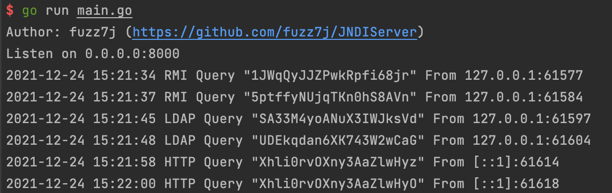

## JNDIServer

-p 指定监听端口，默认8000

### 使用场景

内网不出网机器，无法使用外网DNS验证漏洞。  
为方便漏洞探测，可以获取RMI、LDAP请求的地址，并提供查询接口。

### 查询接口

```
http://localhost:8000/session/value
```

value最大长度20字符，运行时默认写入running。  
可通过 `http://localhost:8000/session/running` 获取运行状态。


### 查询示例

接口基于Socket实现，仅能使用curl获取，标准HTTP包无法使用。

#### GoLang
```go
func main()  {
	rev := make([]byte, 1024)
	conn, err := net.Dial("tcp", "host:port")
	if err == nil {
		conn.Write([]byte("GET /session/start HTTP/1.1"))

		_, err := conn.Read(rev)
			if err == nil {
				fmt.Println(string(rev[:]))
			}
	}
}

```

#### Java
```java
public static String fakeHTTP(String serverHost, String serverPort, String message) {
    String fakeHTTPMessage = "GET " + message + " HTTP/1.1";
    String serverMessage = null;
    int port = Integer.parseInt(serverPort);
    try {
        Socket socket = new Socket(serverHost, port);
        OutputStream outputStream = socket.getOutputStream();
        Writer writer = new OutputStreamWriter(outputStream);
        writer.write(fakeHTTPMessage);
        writer.flush();
        socket.shutdownOutput();

        InputStream inputStream = socket.getInputStream();
        BufferedReader br = new BufferedReader(new InputStreamReader(inputStream));
        while ((serverMessage = br.readLine()) != null) {
            return serverMessage;
        }
    } catch (Exception e) {
        e.printStackTrace();
    }
    return serverMessage;
}
```

### 效果演示


